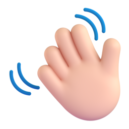

# Hi, I'm Salman   #
**Computer Science Student**     
**Front-end & Back-end Developer**     
**Graphic Designer (Freelance)**    

I’m a Computer Science student with a strong passion for both **software development** and **graphic design**.  
I enjoy solving problems through structured, efficient code, and bringing ideas to life through clean, creative visuals.

## About Me  
- Computer Science student at university  
- Developer since 2019  
- Freelance graphic designer since 2023  
- Passionate about combining logic, creativity, and technology  
- Always learning and improving my technical and design skills  

## Experience  
- **Back-end Developer**  
  Java, Python, C#, SQL Server LocalDB  

- **Front-end Developer** 
  HTML, CSS, JavaScript  

- **Graphic Designer (Freelance)**  
  Adobe After Effects, Adobe Illustrator, Adobe Photoshop, Blender, Procreate  

## Skills   
### Programming & Development
- Java  
- Python  
- C#  
- HTML / CSS / JavaScript  
- SQL Server LocalDB  

### Design & Creative Tools
- Adobe After Effects  
- Adobe Illustrator  
- Adobe Photoshop  
- Blender  
- Procreate  

## Interests  
- Software Engineering & Problem Solving  
- Web Development (Front-end & Back-end)  
- Graphic Design & Motion Graphics  
- UI / UX and visual storytelling  

## Connect  
Feel free to reach out for collaboration!
